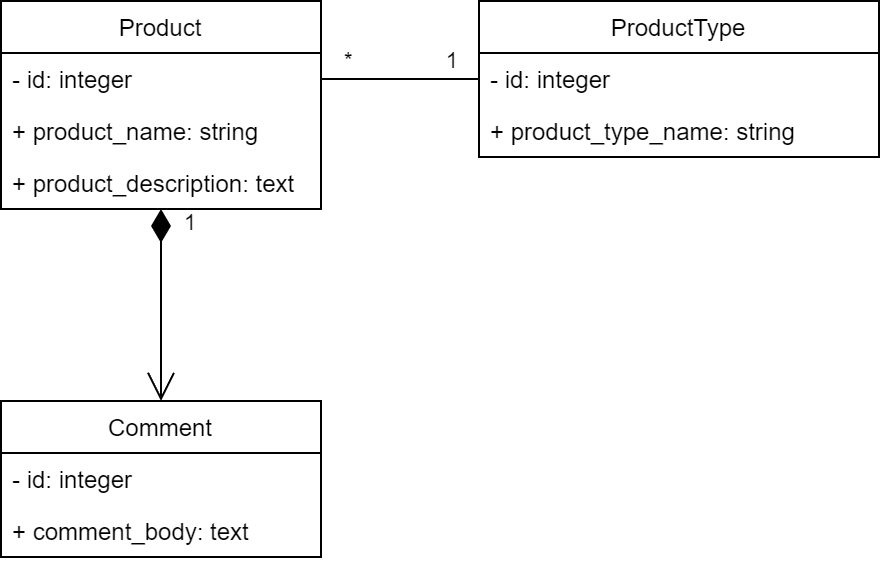
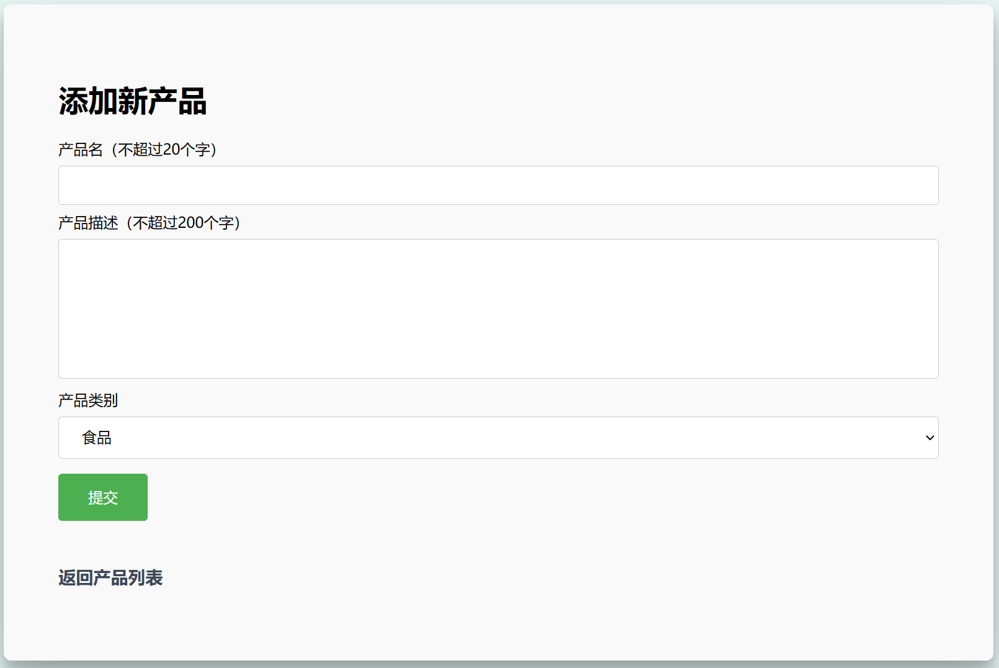
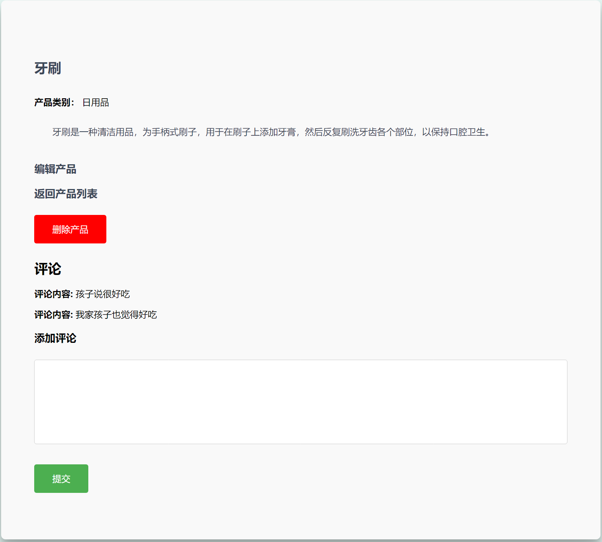
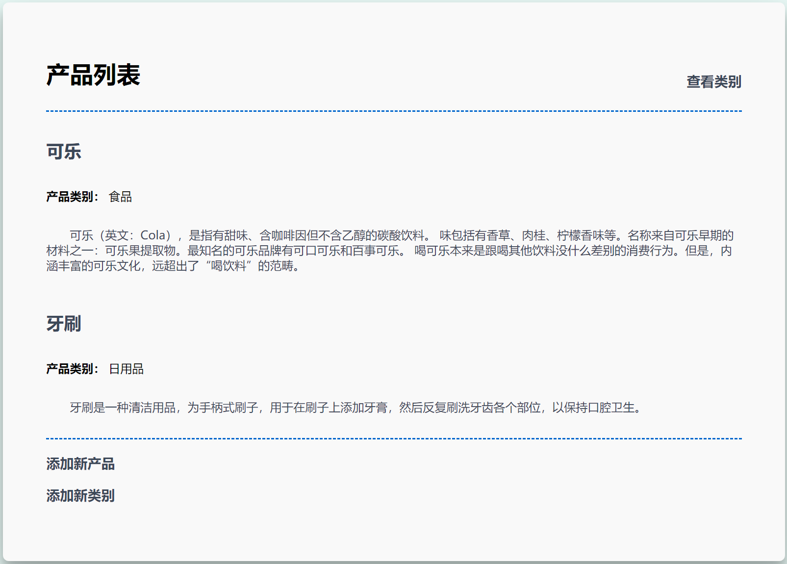
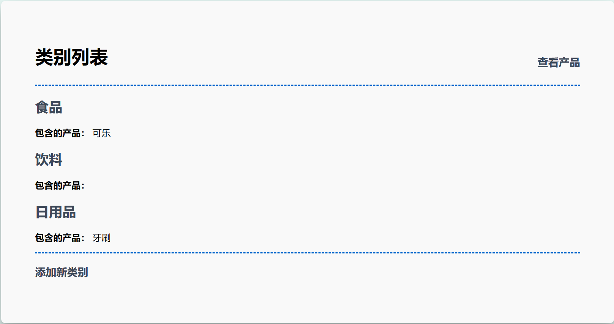

# 产品发布系统设计文档

> 学号：20373883
>
> 姓名：张君豪

## 1. 实体关系

系统共有三个实体：

- Product：产品
- ProductType：产品类型
- Comment：评论

## 2. 操作

### 2.1 创建产品

### 2.2 显示单个产品及相关评论

### 2.3 列出所有产品

### 2.4 按类型查看产品

### 2.5 编辑产品

### 2.6 删除产品

### 2.7 评论

